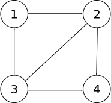
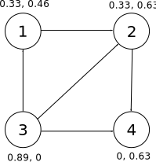
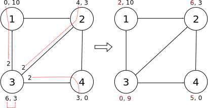
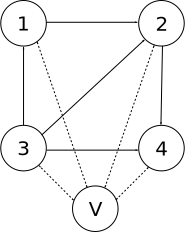
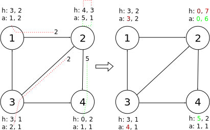
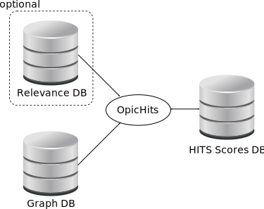

============
OPIC Details
============

HITS
====

Introduction
------------

Since OPIC is just a way of computing the HITS score for each page we
must first understand what the HITS score is. HITS stands for
Hyperlink-Induced Topic Search, originally described in::

    Authoritative sources in a hyperlinked environment
    Kleinber J.
    1998

The idea is to compute for each page a pair of numbers called the
Hub and Authority scores. Intutively we say a page is a hub when it
points to lot of pages with high authority, and we say that a page has
high authority if it is pointed by many hubs. Mathematically this is
expressed as:

.. math::
   
   h_i &= \sum_{j: i \to j} a_j \\
   a_i &= \sum_{j: j \to i} h_j

Where :math:`h_i` represents the hub score of page :math:`i` and
:math:`a_i` represents its authority score. :math:`j: i \to j`
represent the set of pages :math:`j` that are pointed by
:math:`i` and :math:`j: j \to i` represents the set of pages 
:math:`j` that point to :math:`i`. For example, consider the following
set of pages:

The equations to compute the scores would be:

.. math::

   h_1 &= a_2             &\quad a_1 &= h_3\\
   h_2 &= a_4             &\quad a_2 &= h_1 + h_3\\
   h_3 &= a_1 + a_2 + a_4 &\quad a_3 &= 0\\
   h_4 &= 0               &\quad a_4 &= h_2 + h_3

The above equations can be rewritten in matrix form. Let's define:

.. math::

   L = \begin{bmatrix}
       0 & 1 & 0 & 0 \\
       0 & 0 & 0 & 1 \\
	   1 & 1 & 0 & 1 \\
	   0 & 0 & 0 & 0
   \end{bmatrix}

:math:`L` is called the link matrix because it contains all the link
information available in the graph. Notice that :math:`L_{ij}` is 1 if
there is a link between nodes :math:`i` and :math:`j` and 0 otherwise.
If we group the hub and authorities scores in the vectors :math:`h`
and :math:`a` we can write the HITS equations as:

.. math::

   h &= La   &= (LL^T)h &= Hh\\
   a &= L^Th &= (L^TL)a &= Aa

The above equations always have the trivial solutions
:math:`h=a=0`. The other non-zero solutions are given by the
eigenvectors of the matrices :math:`H` and :math:`A`. 

Power iteration
---------------
A very simple and efficient way of getting the eigenvector with the largest
eigenvalue is using the power method: to compute the
largest eigenvector :math:`v` of a matrix :math:`M` simple iterate
long enough starting from a random vector :math:`v^0` 

.. math::

   v^k = Mv^{k-1}

Notice that unless the associated eigenvalue is exactly 1 you will
need to re-normalize after each iteration.

Let's apply this method to our toy problem. Using numpy the code for
the power method is very simple:

.. code-block:: python

    import numpy as np
    

    def power(M, eps=1e-6, max_iter=1000):
        """Compute the largest eigenvector of M.
    
        Returns: the eigenvector and the eigenvalue
        """
        v0 = np.random.rand(M.shape[0])
    
        converged = False
        for i in xrange(max_iter):
            v1 = M.dot(v0)
            v1 /= np.linalg.norm(v1)
            err = np.max(np.abs(v1 - v0))
            if err < eps:
                converged = True
                break
    
            v0 = v1
        if not converged:
            print "Warning: didn't converge"
    
        return v1, M[0, :].dot(v1)/v1[0]
    
And we can apply it to our toy problem:

.. code-block:: python

    L = np.array([
        0, 1, 0, 0, 
        0, 0, 0, 1, 
        1, 1, 0, 1, 
        0, 0, 0, 0]).astype(float).reshape(4,4)
    
    H = L.dot(L.transpose())
    A = L.transpose().dot(L)
        
    h, h_eigv = power(H)
    a, a_eigv = power(A)
    
    print "Hub scores: ", h
    # Hub scores:  [ 0.32505736  0.3250578   0.88807383  0.        ]
    print "Authority scores: ", a
    # Authority scores:  [ 0.45970084  0.62796324  0.          0.62796282]
 
If we represent the scores directly on the graph we see how the scores
correctly represent our intuitive notion of what a hub or an
authoritative page represents:

Notice that the power method can fail. Take for example the matrix
:math:`L`. No matter what initial value we start iterating from, it
will always converge to a zero vector. To see why notice the following
identity which gives name to the power method:

.. math::

   v^k = Mv^{k-1} = M^2v^{k-2} = \ldots = M^kv^0

Now let's compute the different powers of :math:`L`

.. math::

   L^2 &= \begin{bmatrix}
   0 & 0 & 0 & 1 \\
   0 & 0 & 0 & 0 \\
   0 & 1 & 0 & 1 \\
   0 & 0 & 0 & 0
   \end{bmatrix} \\
   L^3 &= \begin{bmatrix}
   0 & 0 & 0 & 0 \\
   0 & 0 & 0 & 0 \\
   0 & 0 & 0 & 1 \\
   0 & 0 & 0 & 0
   \end{bmatrix} \\
   L^4 &= L^5 = \ldots =  0

The reason for this behavior is that the only eigenvalue of :math:`L` is 0. There is
however a non-zero eigenvector associated to the 0 eigenvalue:

.. math::

   \begin{pmatrix}
   0 \\
   0 \\
   1 \\
   0
   \end{pmatrix}

But the power method fails to find it. A trick to solve this problem
is to apply a small perturbation :math:`\epsilon` to :math:`L` and
apply the power method. It should converge to an small perturbation of
the original eigenvector. Let's try:

.. code-block:: python

   print power(L + 1e-5)
   # (array([  5.52652292e-02,   3.23859608e-03,   9.98466441e-01,
   #          1.79833785e-04]), 0.058792257444600315)

As you can see it returns a result very close to the true answer. The
perturbated eigenvector is :math:`(0.055, 0.003, 0.998, 0.000)` and the
perturbated eigenvalue is 0.06.

We finally end making some comments:

1. The power method is efficient because the link matrix is sparse,
   meaning that most of its elements are zero. However we need to have
   it fully loaded in memory to perform an iteration of the algorithm.

2. We don't need to compute the :math:`H` and
   :math:`A` matrices and instead we can perform the following
   iteration:

   .. math::

       h_{k+1} &= La_k \\
       a_{k+1} &= L^Th_k

   Which can also be rewritten as:

   .. math::
	  
	  \begin{pmatrix}
	  h \\
	  a
	  \end{pmatrix}^{k+1} = J
	  \begin{pmatrix}
	  h \\
	  a
	  \end{pmatrix}^{k} 

  Where:

  .. math::

	  J = \begin{bmatrix}
	  0 & L \\
	  L^T & 0
	  \end{bmatrix}

  And we can check that the power method applied to matrix :math:`J`
  gives the same answer as before

  .. code-block:: python

     N = L.shape[0]
     J = np.zeros((2*N, 2*N))
     J[:N, N:] = L
     J[N:, :N] = L.transpose()
     h, a = np.split(power(J, max_iter=1000)[0], 2)
     h /= np.linalg.norm(h)
     a /= np.linalg.norm(a)
   
     print "Hub scores: ", h
     # Hub scores:  [ 0.32505758  0.32505758  0.88807383  0.        ]
  
     print "Authority scores: ",a
     # Authority scores:  [ 0.45970084  0.62796303  0.          0.62796303]

  Actually, it gives a warning about convergence. The reason is that
  the vector built by stacking together :math:`h` and :math:`a`
  oscillates between the following two vectors:

  .. math::

    \begin{matrix}
      (0.200 & 0.200 & 0.545 & 0 & | & 0.363 & 0.496 & 0 & 0.496) \\
      (0.257 & 0.257 & 0.701 & 0 & | & 0.282 & 0.386 & 0 & 0.386)
	\end{matrix}

  However, each half part of the above vectors are equal up to a
  scaling constant, and so the method converge to the correct scores.

OPIC
====

Introduction
------------

OPIC is just an alternative to the power method to compute the largest
eigenvector and so it can be applied to compute the HITS score. It is
described here::

    Adaptive On-Line Page Importance Computation
    Abiteboul S., Preda M., Cobena G.
    2003

Given a page graph, the idea is to maintain for each page two
quantities: the cash and the history. When we update a page the cash
is distributed to its children and the the total quantitiy is added
to the page history. For example, returning to our toy example let's
suppose that at a given instant in time we have the current state of
cash and history associated to each page:

.. image:: _images/opic_example_1.svg
   :align: center

And we update page 3. Since it has 6 units of cash it will distribute
2 units to each one of its 3 children. It will also increment its
history by 6 units, since this is the total amount of cash it has
distributed and its cash will be reset to 0. The following image shows
the change in the graph state after a single update.

If we keep performing these updates, making sure that we update all
pages, the history of the pages will converge, after normalization, to
same value of the power method applied to the following matrix:

.. math::

   \bar{L} = \begin{bmatrix}
   0 & 0 & \frac{1}{3} & 0 \\
   1 & 0 & \frac{1}{3} & 0 \\
   0 & 0 & 0           & 0 \\
   0 & 1 & \frac{1}{3} & 0   
   \end{bmatrix}

You can see that :math:`\bar{L}` is very similar to :math:`L^T` since
its actually the same matrix transposed, where each column has been divided by a
normalizing factor, so as to make each column add to 1. 

The utility of the OPIC method lies in the fact that it does not
matters the order in which we update the pages, nor it matters if we
update some pages more than others, as long as all pages are updated
periodically. 

However, we must remember that the power method sometimes fail to
converge and we solved it by adding an small perturbation to the link
matrix. We make an equivalente modification to the OPIC algorithm by
adding an small modification to the graph: we add a virtual page that
links and is linked by all other pages. For our toy problem it would
look like this:

Let's check our claims with some code. The following code will apply
the OPIC algorithm to an arbitrary graph. For simplicity the graph is
represented as a dictionary where the key is the node name and the
value is a list of outgoing nodes. 

.. code-block:: python

   def add_virtual_page(graph):
       new_graph = {node: children + ['V']
                    for node, children in graph.iteritems()}
       new_graph['V'] = graph.keys()
       return new_graph
   
   example = add_virtual_page(
       {1: [2],
        2: [4],
        3: [1, 2, 4],
        4: []}
   )

We now implement the algorithm, where the next page to update is
randomly selected.

.. code-block:: python

   import random

   def opic(graph, n_iter=100):
       """Simple implementation of OPIC where all children get the
	   same cash"""

       # get the list of nodes
       nodes = graph.keys()
       # build a dictionary to hold cash and history
       # we give each page an initial cash of 1
       state = {node: (1.0, 0.0) for node in nodes}
       for i in xrange(n_iter):
           node = random.choice(nodes)
           cash, history = state[node]
           children = graph[node]
           # distribute cash to children
           n_children = len(children)
           for child in children:
               child_cash, child_history = state[child]
               state[child] = (child_cash + cash/n_children,
                               child_history)
           # update node state
           state[node] = (0.0, history + cash)
   
       # return normalized history
       history = [state[n][1] for n in nodes]
       total = sum(history)
       return zip(nodes, [h/total for h in history])
    

To compare against the power method we build the equivalent link
matrix, where the last row/column corresponds to the virtual page. 
First without normalization:

.. math::

   L = \begin{bmatrix}
       0 & 1 & 0 & 0 & 1\\
       0 & 0 & 0 & 1 & 1\\
	   1 & 1 & 0 & 1 & 1\\
	   0 & 0 & 0 & 0 & 1\\
	   1 & 1 & 1 & 1 & 0
   \end{bmatrix}   

And after transposition and normalization:

.. math::

   \bar{L} = \begin{bmatrix}
   0           & 0           & \frac{1}{4} & 0 & \frac{1}{4} \\
   \frac{1}{2} & 0           & \frac{1}{4} & 0 & \frac{1}{4} \\
   0           & 0           & 0           & 0 & \frac{1}{4} \\
   0           & \frac{1}{2} & \frac{1}{4} & 0 & \frac{1}{4} \\
   \frac{1}{2} & \frac{1}{2} & \frac{1}{4} & 1 & 0
   \end{bmatrix}   

We can compare now the two methods:

.. code-block:: python

   for node, score in opic(example, n_iter=1000):
       print node, score

   # 1 0.198500025862
   # 2 0.298524016644
   # 3 0.157148867939
   # 4 0.345827089555

   L = np.array([
       0, 1, 0, 0, 1,
       0, 0, 0, 1, 1,
       1, 1, 0, 1, 1,
       0, 0, 0, 0, 1,
       1, 1, 1, 1, 0]).astype(float).reshape(5, 5)
   
   
   p, k = power(make_stochastic(L.transpose()))
   p = p[:4]
   p /= np.linalg.norm(p, ord=1)
   print p
   # [ 0.19801978  0.29702981  0.15841572  0.34653469]

So, to summarize, if we have a matrix :math:`M`, where each rows sums
to 1, we can compute its largest eigenvector either by using the power
method on that matrix or by applying the OPIC algorithm in an
associated graph which has an edge from :math:`i` to
:math:`j` if :math:`M_{ji} \neq 0`. When node :math:`i` with cash
:math:`c_i` inside the node is updated it will give :math:`M_{ji}\cdot
c_i` cash to node :math:`j`.

Application to HITS
-------------------

Notice that we really cannot apply OPIC as HITS without modifying the
problem, since we have the requirement of all columns (or rows,
depending what you consider) summing to 1. This is a requirement for
the OPIC algorithm to work, since it assures that the amount of cash
inside the graph remains constant. Otherwise the cash would go to 0 or
to :math:`\infty`.

We will now use 4 scores for each
page: hub cash and history and authority cash and history. When we
update a page it will send its hub cash distributed to all its
predecessors' authority cash, and add it to its hub history. It will send also its
authority cash distributed to all its children's hub cash and add it to its
authority history. 

The following figure shows a single step of the algorithm applied to
our toy problem, where we have ignored the virtual page to simplify
things. Actually it's not necessary to update in the same
step the two scores however we show here both the hub and authority
cash flow.

Notice that with this algorithm what remains constant after each step
is the total amount of cash, that is, the sum of the hub and authority
cash.

Adaptive OPIC
-------------

The adaptive version of the OPIC algorithm takes into account the case
where the graph is changing. In this case the pages that were from the
beginning inside the graph have accumulated more history than the
newer ones, even if the later are more important. Of course, if we
freeze the graph this unbalance will in the long term be corrected but
it could take lot of time. 

One possible solution would be to discard all the pages history and
restart again, but this is overkill since probably we are already near
to the correct solution. The adaptive version of OPIC proposes a
middle ground: to discard the history before a certain time starting
from now. To do this exactly we would need to save the history of each
page at every point of time. A more efficient alternative is to
estimate how much history we should discard. This is called in the
original paper history interpolation and is the approach that has been
taken in this implementation.

Notice that the adaptive version has introduced a new parameter: a
time window outside of which we should ignore history.

Adding external relevance measure
---------------------------------

Although once of the nice properties of HITS scoring is that it only
requires link information it has been demonstrated that adding content
based information can greatly improve the effectivenes of topic
focused crawlers. There are lots of ways in which we could fusion an
external relevance score and the HITS scores to give a global score of
page relevance and we will describe now the one developed in this
case.

We will consider that the external relevance score is another measure
of the page authority (a good hub can be empty of content, as long as
it points to relevant one) and ranges between 0 (not relevant at all)
and 1 (completely relevant). 

With this in mind we modify the distribution of authority cash when we
update a page. Let's call :math:`r_i` the relevance score for page
:math:`i`, which has :math:`P_i` parent pages pointing to it. If page
:math:`i` is relevant we want to distribute all its authority cash
back to its parents, but if it's not relevant we want to avoid
distributing any cash back. Since we don't want to destroy cash what
we will do instead is to give that cash to the virtual
page. 

.. image:: _images/opic_relevant.svg
   :align: center

Mathematically, if we have :math:`a_i` authority cash:

1. Give :math:`a_i\cdot z(r_i)` cash to each parent page.
2. Give :math:`a_i[1 - P_i\cdot z(r_i)]` cash to the virtual page.

Where :math:`z` is a function of the page relevance and must satisfy
the following conditions:

.. math::

   z(0)   &= 0                 &\quad \text{No cash goes back to the parents} \\
   z(1)   &= \frac{1}{P}       &\quad \text{All cash goes back to parents} \\
   z(0.5) &= 1 - P\cdot z(0.5) &\quad \text{The virtual page counts as
                                            another parent}

Notice that the third condition is equivalent to saying that when the
relevance is 0.5 the algorithm is equivalent to OPIC without external
relevance score.

One possible function :math:`z(r)` can be build by considern the
second order polynomial fitting all the above points:

.. math::

   z(r) = \frac{2r}{P}\left( \frac{2P}{P+1}(1 - r) + (r - 0.5)\right)

Implementation
--------------

The algorithm described in the previous sections is implemented inside
this class:

.. autoclass:: crawlfrontier.contrib.backends.opic.opichits.OpicHits
   :members:

As you can see it has one optional paramter, the time window of the
adaptive version, and 3 external database components:

The facilitate adding different database backends their interface has
been extracted in different abstract metaclasses.

Graph database
~~~~~~~~~~~~~~

Every class implementing the following interface can be a drop-in
replacement for the included SQLite backend. It is not a requirement
to inherit from this class, but is recommended for checking the interface
at compile time.

Notice that this database is only accessed from
:class:`.opichits.OpicHits` via read operations.

.. autoclass:: crawlfrontier.contrib.backends.opic.graphdb.GraphInterface
   :members:

The following class is a simple implementation of the above
interface using SQLite. It maintains a table with edges and a table
with nodes. The table is fully indexed for performance.

.. autoclass:: crawlfrontier.contrib.backends.opic.graphdb.SQLite
   :members:

Relevance database
~~~~~~~~~~~~~~~~~~

If this database is provided :class:`.opichits.OpicHits` will consult
the score associated to each page to decide how to distribute the
authority score.

Notice that this database is only accessed from
:class:`.opichits.OpicHits` via read operations.

As usual, there is an interface which all backends must satisfy:

.. autoclass:: crawlfrontier.contrib.backends.opic.relevancedb.RelevanceDBInterface
   :members:

And there is also a batteries included SQLite implementation of the
interface:

.. autoclass:: crawlfrontier.contrib.backends.opic.relevancedb.SQLite
   :members:

HITS scores database
~~~~~~~~~~~~~~~~~~~~

The HITS database contains the state of the OPIC algorithm. 
Since there are several values to maintain for each page a new class
has been created for storing them:

.. autoclass:: crawlfrontier.contrib.backends.opic.hitsdb.HitsScore
   :members:

First, the interface.

.. autoclass:: crawlfrontier.contrib.backends.opic.hitsdb.HitsDBInterface
   :members:

And of course, the SQLite already provided implementation:

.. autoclass:: crawlfrontier.contrib.backends.opic.hitsdb.SQLite
   :members:

.. Scheduler
.. =========
.. 
.. Introduction
.. ------------
.. 
.. 
.. Implementation
.. --------------
.. .. automodule:: crawlfrontier.contrib.backends.opic.schedulerdb
..    :members:
.. 
.. .. automodule:: crawlfrontier.contrib.backends.opic.scheduler
..    :members:
.. 
.. .. automodule:: crawlfrontier.contrib.backends.opic.freqdb
..    :members:
.. 
.. .. automodule:: crawlfrontier.contrib.backends.opic.freqest
..    :members:
.. 
.. .. automodule:: crawlfrontier.contrib.backends.opic.hashdb
..    :members:
.. 
.. .. automodule:: crawlfrontier.contrib.backends.opic.pagechange
..    :members:
.. 
.. .. automodule:: crawlfrontier.contrib.backends.opic.updatesdb
..    :members:
.. 
.. 
.. All together
.. ============
.. 
.. .. autoclass:: crawlfrontier.contrib.backends.opic.backend.OpicHitsBackend
..    :members:
.. 
.. 
.. .. automodule:: crawlfrontier.contrib.backends.opic.pagedb
..    :members:
.. 
.. .. automodule:: crawlfrontier.contrib.backends.opic.sqlite
..    :members:

