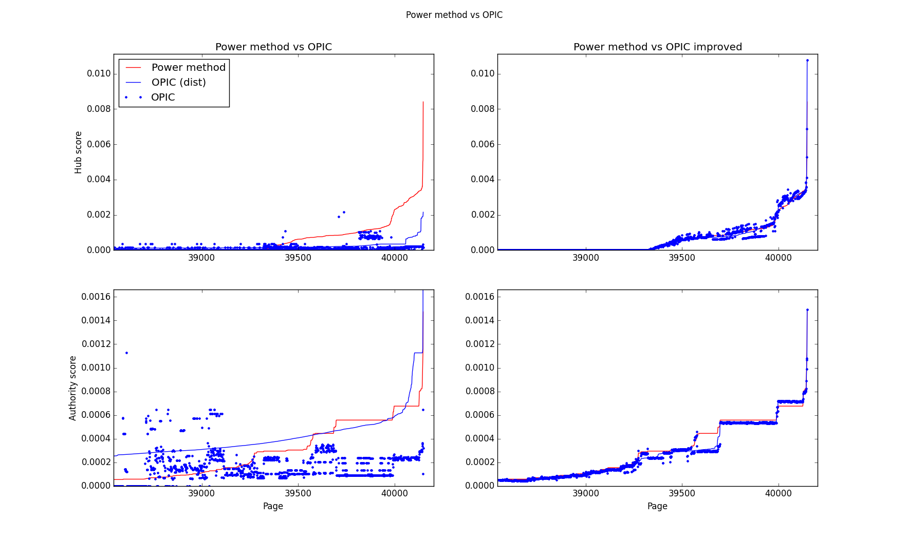
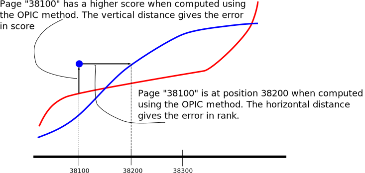

====================
OPIC vs power method
====================

In the following document we analyze a real crawl, obtained from
running the example in the crawl-frontier repository. It may take some
time::

    crawl-frontier/examples/scrapy_frontier$ scrapy crawl example -s MAX_REQUESTS=2000
    2015-01-30 22:32:33+0100 [scrapy] INFO: Scrapy 0.24.4 started (bot: scrapy_frontier)
    .
    .
    .
    2015-01-30 22:46:46+0100 [example] INFO: Spider closed (finished)

After that you should have a directory crawl-opic populated with
several databases::

   crawl-frontier/examples/scrapy_frontier/crawl-opic$ ls -1sh
   total 71M
   540K freqs.sqlite
    45M graph.sqlite
   156K hash.sqlite
   7,9M hits.sqlite
   8,3M pages.sqlite
   4,6M scheduler.sqlite
   4,9M updates.sqlite

For a description of what the above databases are about see
:ref:`opic-databases`. In particular, two databases in the above list
give us an snapshot of the OPIC algorithm state: graph and hits. 

The following script even allow us to run the OPIC algorithm whithout
the crawler running and see how the OPIC score converges to the score
computed using the power method, validating therefore the correcteness
of our implementation. 

You can download :download:`download the script
<_src/opic-precision.py>` too.

.. literalinclude:: _src/opic-precision.py

We can run the above script::

   crawl-frontier/examples/scrapy_frontier$ python opic-precision.py crawl-opic/
   Converting crawled graph to sparse matrix...  done
   Computing HITS scores using power method...  done
   Error of OPIC algorithm (L^inf metric):
       Hub score      :  0.00589243418972
       Authority score:  0.00451756698138
   Additional opic iterations
        1000
        2000
        3000
        4000
        5000
        6000
        7000
        8000
        9000
       10000

And at the end it will generate a plot comparing the hub and authority
scores as computed by the power method and OPIC. We include now a zoom
of the plot near the highest scored pages, which is the most
interesting method and discuss the meaning of the plot.

first notice that we requested 2000 pages but if you look at the
x-axis of the figure there are more than 40000 pages. This is because
we not only show crawled pages, but also uncrawled links, which
constitute most of the graph database.

There are two rows in the above plot. The first row shows hub scores
and the second row shows authority scores. Also, the first column
shows a comparison of the power method vs the OPIC scores, just as
they were in the database after the crawl finished. The second column
show the same result for the power method, but the OPIC scores are
improved by performing additional iterations of the algorithm without
crawling additional pages. 

Each subplot has three lines. The red line shows the power method
score for each page. The continous blue line shows the OPIC score for
each page, but without having the pages in the same ordering as the
power method. Showing this line is useful to have a look of how the
OPIC scores are distributed but we cannot compare directly the red and
blue lines. The dots show the OPIC score for each page, this time with
the same page ordering as the power method. We can use the three lines
to get an idea of what are the differences between the scores computed
by the OPIC and the power method. The following figure explains how:

With this in mind we can see in the plot of OPIC vs power method that:

1. After the crawl is finished there is quite a difference in the
   scores, although there is a good correlation between OPIC and the
   power method. This means that both methods will likely agree that a
   page is in the top 5% of pages, but the exact score or rank within
   that margin could be very different.

2. If we continue iterating the OPIC algorithm after the crawl is
   finished the scores between the two methods converge. This is
   mainly because the OPIC algorithm plays with unfair rules: it
   computes the score while the graph is growing, while the power
   method was run with the graph frozen. This shows that if we run
   both methods in equal conditions they get the same results. That's
   why we need the adaptive version of the OPIC algorithm, however,
   tuning the time window parameter is difficult. Another solution is
   to iterate more frequently the OPIC algorithm when the graph
   changes, but this consumes a lot of CPU.
