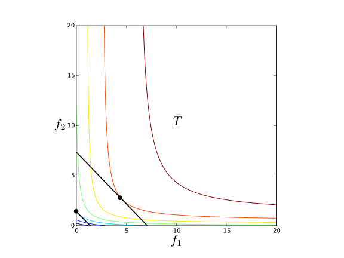
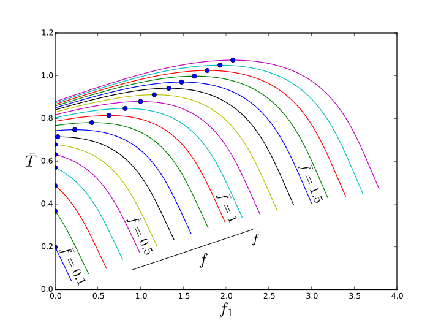
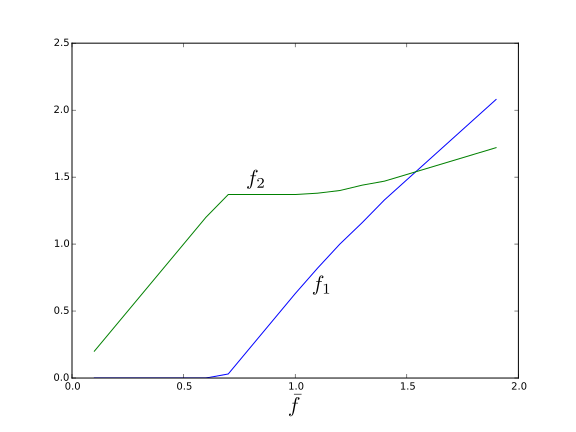
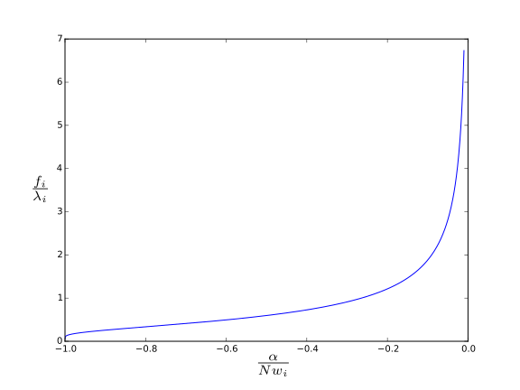
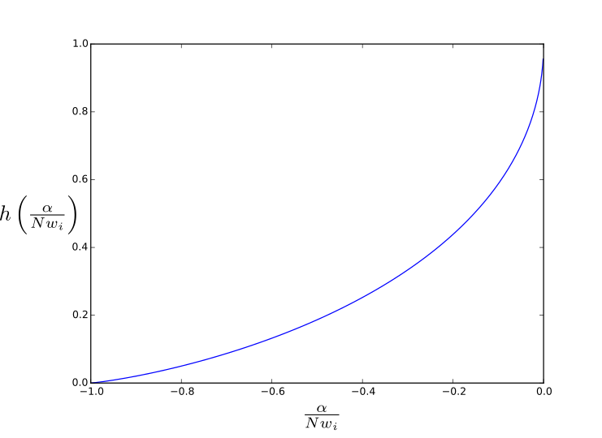

============================
Optimal revisiting algorithm
============================

Introduction 
============ 

This algorithm is based mainly on the following paper::

   Effective Page Refresh Policies For Web Crawlers 
   Junghoo C. and Garcia-Molina H. 

I will keep the notation similar to the above paper, and I will
summarize some results to make it easier to follow.

The problem is: we have several web pages, which have possibly changed
since the last time we crawled them. We want to know the optimal
refreshing rate for them, for some meaning of optimal. Obviously, the
refreshing rate cannot be unbounded, since we have a limited bandwith
and computer resources.

Refreshing rate restriction
===========================

First, we repeat some concepts from the original paper.

- :math:`I_i`: time interval between consecutive
  refreshes for page :math:`i`, this is the unknown we want to
  calculate.

- :math:`f_i`: refreshing frequency, just :math:`f_i=1/I_i` 

- :math:`\lambda_i`: change rate for page :math:`i`. We make the
  assumption that change rates for web pages follow a Poisson
  process. It seems this is a very reasonable assumption.

- :math:`N`: total number of pages we want to refresh in a
  time interval :math:`I` 

- :math:`\bar{f}`: mean refreshing rate: :math:`\bar{f}=1/I`

We can now state our refreshing rate constraint: during time interval
:math:`I` we refresh :math:`I/I_i` number of times page :math:`i`. It must be:

.. math::
   
   \sum_{i=1}^N \frac{I}{I_i}=N 

Or equivalently by simple manipulation:

.. math::

   \frac{1}{N}\sum_{i=1}^Nf_i=\bar{f}

Target function
===============

We now define the value of a new page refresh :math:`V_i`, which is our
first step towards a global value function, which we want to
maximize. Notice that this target function is different from the
original paper, which considered two different ones: freshness and
age. We will however follow the same process, but for this different
objective.

.. math::

   V_i = \begin{cases} 
            w_i & \mbox{if new content found} \\ 
              0 & \mbox{otherwise } 
	     \end{cases}

Of course, we don't know the value :math:`V_i` until we refresh the page,
but we can compute its expected value. Remember we said refreshing
rates follow a Poisson distribution, so we have that if :math:`X` is the
number of page modifications since last time we refreshed:

.. math:: 

   Pr\{X=0\} &=e^{-\lambda t} \\ 
   Pr\{X>0\} &= 1 - e^{-\lambda t} 

Where :math:`t`  is the amount of time that has passed since the last refresh.

The expected value of a refresh, is then:

.. math::

   E[V_i(t)]=Pr\{X=0\} \cdot 0 + Pr\{X>0\} \cdot w_i =
	w_i(1 - e^{-\lambda_i t_i}) 

We could finish now and say that our strategy is to crawl at each
instant :math:`t` the page that maximizes the expected refresh value
:math:`E[V_i(t)]`. This however has two problems:

- Even if a page has at a given time the maximum
  expected value, it could be better to wait and refresh it later, since
  it may have a higher expected value.  

- This expected value is a
  function of time and we would need to recompute constantly the
  expected value of all our candidate pages. Consider the following
  figure showing three different possible curves for :math:`E[V_i(t)]` for
  three different pages, as a function of time. Notice how the page with
  the maximum expected value moves as a function of time.  

  .. image:: _images/expected_refresh_value.svg                     
     :align: center

The problem of which pages to refresh in the next period
of time, such to as maximize the gained value in that period is very
difficult, but we can make it more simple if that period of time goes
to infinity, meaning that we search for a strategy that maximizes the
value gained in all future time. In this case, we are a looking for an
stationary solution and all our unknowns are the frequency at which we
refresh each page.

If we refresh page :math:`i` with frequency :math:`f_i` the expected value for
each refresh is:

.. math::

   \bar{V}_i = w_i\left(1 - e^{-\lambda_i/f_i}\right)
	

And the value per unit of time we extract from the page is:

.. math::

   \bar{T}_i = f_i\bar{V}_i=f_iw_i\left(1 -
	e^{-\lambda_i/f_i}\right) 

Our target function is the total value per unit of time:

.. math::

   \bar{T} = \sum_{i=1}^N f_iw_i\left(1 -
	e^{-\lambda_i/f_i}\right) 

And the optimization problem we want to solve is:

.. math::

   \underset{f}{\text{maximize }} \bar{T} 

And for :math:`i=1\dotsc N` we have the constraints:

.. math::

   \frac{1}{N}\sum_{i=1}^N f_i &= \bar{f} \\ 
   f_i &\geq 0

Let's have a look at the shape of our problem. The following figure
shows the behavior of the function :math:`\bar{T}` (with :math:`w=1`):

.. image:: _images/target.svg
   :align: center

The following figure shows the constraints for a problem with just two
pages: 

We can graphically solve the problem for a particular instance if we
restrict ourselves with two pages. For example, consider the following
weights and refresh rates for two pages:

.. math:: 

   w_1 &= 1 & \lambda_1 &= 5 \\
   w_2 &= 5 & \lambda_2 &= 1

If we plot the contour curves for :math:`\bar{T}` and the constraints we see
that there are two kinds of solutions, depending of whether the
maximum happens in the interior or in the boundaries (:math:`f_1 = 0` or
:math:`f_2=0`):

If we cut the surface :math:`\bar{T}` with the plane defined by the
constraint :math:`(f_1 + f_2)/2=\bar{f}` we transform the problem into a
maximization problem in just one unknown:

We see that for low values of :math:`\bar{f}`, it's better to not refresh at
all the first page. However, as the available frequency increases it
starts to make sense to refresh all pages. The following figure shows
the refresh frequencies for the two pages as a function of the
available frequency :math:`\bar{f}`. It's interesting to note that although
initially the first page is not refreshed at all, past a certain value
of :math:`\bar{f}` it is refreshed more frequently than the other one.

Solution computation
====================

Introducing the Lagrange multipliers
:math:`\alpha` and :math:`\beta=(\beta_i, i=1\dotsc N)` we build the Lagrangian:

.. math::

   L = \bar{T} + \alpha\left(\frac{1}{N}\sum_1^N f_i -
   f\right) + \frac{1}{2}\sum_1^N\beta_i^2 f_i 

A necessary condition for a solution to be a local optimum requires
that the gradient of the Lagrangian vanishes (Karush–Kuhn–Tucker
conditions):

.. math:: 

   \nabla_f L &= 0 \\ 
    \frac{\partial L}{\partial \alpha} &= 0 \\ 
   \nabla_\beta L &= 0 

Since :math:`\bar{T}` is a linear combination of :math:`\bar{T}_i`, and each
:math:`\bar{T}_i` is concave, then :math:`\bar{T}` is concave. Since our
constraints are linear the whole problem is concave and any local
maximum is also a global maximum. Furthermore, there are no local
minimums, so every solution that satisfies the KKT conditions is a
global maximum.

Newton-Raphson's method
-----------------------

We now to try to solve the KKT
equations directly.  Calling :math:`h = \nabla L`, we must make :math:`h = 0` to
find an equilibrium point. There are therefore :math:`2N + 1` equations to
solve: 

.. math::

   i&=1...N & h_i &= \frac{\partial L}{\partial f_i} 
   &&=\frac{\partial \bar{T}}{\partial f_i} + \frac{1}{N}\alpha +
   \frac{1}{2}\beta_i^2 &= 0 \\ 
   i&=1...N & h_{N+i} &= \frac{\partial
   L}{\partial \beta_i} &&= \beta_i f_i &= 0 \\ 
   && h_{2N+1} &=
   \frac{\partial L}{\partial \alpha} &&= \frac{1}{N}\sum_1^Nf_i - f &= 0

Calling :math:`x=(f, \beta, \alpha)`, the Newton-Raphson method makes the
following approximation of the function in the neighborhood of the
point :math:`x_k`:

.. math::

   h(x) \approx h(x_k) + \left(\nabla h\right)_k (x - x_k) 

From the above, we have: 

.. math:: 

   x_{k+1} &= x_k + \left(\Delta x\right)_k \\ 
   \left(\nabla h\right)_k \left(\Delta x\right)_k &= -h(x_k) 

Solving for :math:`\Delta x` is not difficult, since our equations are
loosely coupled:

.. math::

   \forall i \neq j \quad \frac{\partial h_i}{\partial
	f_j} = \frac{\partial h_{N+i}}{\partial f_j} = 0 

So we have:

.. math:: 

   i&=1 \dotsc N & \frac{\partial^2 \bar{T}_i}{\partial
	f_i^2}\Delta f_i + \beta_i\Delta \beta_i + \frac{1}{N}\Delta
	\alpha &= -h_i\\ 
   i&=1 \dotsc N & \beta_i \Delta f_i + f_i \Delta\beta_i &= -h_{N+i} \\ 
   && \frac{1}{N}\sum_1^N\Delta f_i &= -h_{2N+1} 

And we can solve easily the above system of equations. 
For :math:`i =1 \dotsc N` compute: 

.. math::

   \frac{\partial \bar{T}}{\partial f_i} &= w_i \left[ 1 - \left(1 + \frac{\lambda_i}{f_i}\right)e^{-\lambda_i/f_i} \right] \\
   a_i                                   &= \frac{1}{ \beta_i^2 + w_i \left(\frac{\lambda_i}{f_i}\right)^2e^{-\frac{\lambda_i}{f_i}} } \\ 
   b_i                                   &= \frac{\partial \bar{T}_i}{\partial f_i} + \frac{1}{N}\alpha - \frac{1}{2}\beta_i^2

Compute then: 

.. math::

   \Delta \alpha = \frac{1}{\sum_1^N
   a_if_i}\sum_1^N \left[ f - f_i\left(1 + a_ib_i\right) \right]

And then again for :math:`i = 1 \dotsc N`: 

.. math::
  
   \frac{\Delta
   f_i}{f_i} &= a_i\left(b_i + \frac{1}{N}\Delta \alpha\right) \\ 
   \Delta
   f_i &= f_i\left(\frac{\Delta f_i}{f_i}\right) \\ 
   \Delta \beta_i &=
   -\beta_i\left(1 + \frac{\Delta f_i}{f_i}\right) 

Notice that once that :math:`f_i=0` or :math:`\beta_i=0` the algorithm gets stuck
at that value. The problem with this is that as new pages are added,
or maybe already present pages are changed (in :math:`w_i` or :math:`\lambda_i`)
:math:`L` changes. It would be very convenient to start searching for a new
solution from the current one, since it's an iterative procedure,
however we cannot do that, since once a page has its refresh frequency
set to zero, it cannot change.

Dual ascent
-----------

Since our problem is concave, then we know
that the solution to our original problem is also the solution to the
unconstrained problem:

.. math::

   \underset{\alpha,\beta}{\min}\,\underset{f}{\max}\,L

In more intuitive terms, the solution to the constrained maximization
problem is given by a saddle point of the Lagrangian.

We could just use a gradient descent: 

.. math:: 

   f^{k+1} &= f^k + \epsilon\nabla_f L \\ 
   \alpha^{k+1} &= \alpha^k - \epsilon
   \frac{\partial L}{\partial \alpha} \\ 
   \beta^{k+1} &= \beta^k - \epsilon \nabla_\beta L 

However we get the same problem of getting stuck when reaching
:math:`\beta_i=0`. Notice that the update equation is: 

.. math::

   \beta^{k+1}=\beta^k(1 - \epsilon f^k) 

We drop the inequality multipliers from the Lagrangian and impose
these constraints directly while searching for a new point.

Our new Lagrangian is therefore: 

.. math::

   L = \bar{T} + \alpha\left(\frac{1}{N}\sum_1^N f_i - \bar{f}\right) 

For a fixed value of :math:`\alpha` we first solve: 

.. math::

   Q(\alpha)=\underset{f}{\max}\,L(f, \alpha) 

Subject to: 

.. math::

   f \ge 0 

Notice that:

.. math::

   \frac{\partial^2 \bar{T}}{\partial f_i^2} =
   -w_i\frac{\lambda_i^2}{f_i^3}e^{-\frac{\lambda_i}{f_i}} 

And we have that: 

.. math::

   \lim_{f_i \to 0}\frac{\partial^2 \bar{T}}{\partial f_i^2} &= 0 \\ 
   \frac{\partial^2 \bar{T}}{\partial f_i^2} & \le 0 

This means that: 

.. math::

   \max\,\frac{\partial
   \bar{T}}{\partial f_i} = \left.\frac{\partial \bar{T}}{\partial
   f_i}\right|_{f_i=0}=w_i 

Notice also that the Lagrangian can be decomposed in: 

.. math::

   L&= \sum_1^N L_i - \alpha\bar{f} \\ 
   L_i &= \bar{T}_i + \frac{1}{N}\alpha f_i 

The maximization of :math:`L` relative to :math:`f` is equivalent to the
maximization of each :math:`L_i` relative to :math:`f_i`.

We can see that the maximization of :math:`L_i` relative to :math:`f_i` have the
following solutions depending on the value of :math:`\alpha`: 

.. math::

   \text{If }\alpha & \ge 0 & \frac{\partial L_i}{\partial f_i} &> 0 &
    f_i &\to \infty \\ 
   \text{If }\alpha & \le -Nw_i & \frac{\partial
    L_i}{\partial f_i} &< 0 & f_i &= 0 

Otherwise we solve: 

.. math::

   \frac{\partial L_i}{\partial f_i}
   = \frac{\partial \bar{T}_i}{\partial f_i} + \frac{1}{N}\alpha = 0

The above equation gives a solution of the form:

.. math::

   \frac{f_i^*}{\lambda_i}=g\left(\frac{\alpha}{w_iN}\right) 

We can pre-compute :math:`g(x)` function for :math:`-1 < x < 0` with:

.. math::

   u^{k+1} &= \log \frac{1 + u^{k}}{1 + x} \\ 
   g(x) &=\frac{1}{\lim_{k \to \infty}u^k} 

Using the above we get the following figure: 

We have now an efficient method to compute: 

.. math::

   Q(\alpha)=L(\alpha, f^*) 

We now need to solve: 

.. math::

   \underset{\alpha}{\min}\,Q(\alpha) 

Which is an unidimensional minimization problem. We play safe and use
the golden search algorithm, which is guaranteed to find the minimum
even when the first derivative is not continuous. We search inside the
region :math:`\alpha \in [-N\underset{i}{\max}\,w_i, 0]`.

For a description of the golden section search algorithm see for
example:: 

   Numerical Recipes, Third Edition Section
   10.2 Golden Section Search in One Dimension

Approximation for a large number of pages
-----------------------------------------

Substituting

.. math::

   f_i^*=\lambda_i g\left(\frac{\alpha}{Nw_i}\right)

in the Lagrangian we get: 

.. math:: 

   Q_i &= L_i(\alpha, f_i^*) =
   \lambda_i w_i h\left(\frac{\alpha}{Nw_i} \right) \\
   h\left(\frac{\alpha}{Nw_i}\right) &=
   g\left(\frac{\alpha}{Nw_i}\right)\left\{ 1 -
   e^{-\left[g\left(\frac{\alpha}{Nw_i}\right)\right]^{-1}} +
   \frac{\alpha}{w_iN} \right\} 

The following figure shows the shape of :math:`h`: 

Now, imagine we cluster the values of the pages :math:`w` in :math:`K`
clusters. Let's call :math:`W[k]` the value of the :math:`k^{th}` cluster and
:math:`I[k]` will be the indices of pages inside the cluster:

.. math::

   I[k] = \left\{i: w_i \sim W[k] \right\}

Then we rewrite :math:`Q` as: 

.. math:: 

   Q(\alpha) &= \sum_{i=1}^NQ_i - \alpha\bar{f} = \\ 
   &= \sum_{k=1}^K\sum_{i \in I[k]}Q_i - \frac{\alpha}{N}\bar{f}

And make the approximation: 

.. math::

   \sum_{i \in I[k]}Q_i = \left(\sum_{i \in I[k]}\lambda_i\right)W[k]
   h\left(\frac{\alpha}{NW[K]}\right) 

We call the accumulated page refresh rate inside the cluster :math:`k` as:
.. math::

   \Lambda [k] = \sum_{i \in I[k]}\lambda_i

Finally, we rephrase our minimization problem: 

.. math::

   Q(\alpha) = \sum_{k=1}^K \Lambda[k]W[k]
   h\left(\frac{\alpha}{NW[k]}\right) - \alpha\bar{f} 

Of course it remains open how to actually perform the clustering, an
operation that can be in itself costly. As a first approximation we
can assume that :math:`0 < w_i \le 1` and divide this interval equally in
:math:`K` clusters:

.. math:: 
   
   W[k] &= \frac{1}{2N}(2k-1) \\ I[k] &= \left\{i:
   \frac{1}{N}(k-1) < w_i \le \frac{1}{N}k \right\}

Implementation
==============

The above algorithm main class is implemented in 

.. autoclass:: crawlfrontier.contrib.backends.opic.scheduler.OptimalSolver
   :members:

And the supporting algorithms are also implemented inside the same module.
The "clustering" algorithm is in

.. autoclass:: crawlfrontier.contrib.backends.opic.scheduler.WCluster
   :members:

And the golden section search has been also implemented to avoid external 
dependencies:

.. autofunction:: crawlfrontier.contrib.backends.opic.scheduler.golden_section_search

==============================================
Estimation of page change rate :math:`\lambda`
==============================================

So, we have refreshed a page with the following intervals of time
between refreshes, for :math:`M` different refreshes:

.. math::

   I^1, I^2 \dotsc I^M 

We partition the set of refreshes into two sets: :math:`U` is the set of
refreshes when the page has been updated and :math:`S` is the set of
refreshes where we observed the page remained the same. More exactly:

.. math::

   U \cup S &= {1 \dotsc M} \\ 
   U \cap S &= \emptyset \\ 
   i \in U &\implies \text{Page changed at the end of } I^i \\ 
   i \in S &\implies \text{Page did not change at the end of } I^i 

The likelihood of this observation:

.. math::

   L &= \prod_{i \in S} e^{-\lambda I^i} \prod_{i \in U}
   \left(1 - e^{-\lambda I^i} \right) \\ 
   &= e^{-\lambda \sum_{i \in S }I^i} \prod_{i \in U} \left(1 - e^{-\lambda I^i} \right)

The log-likelihood:

.. math::

   \log L = -\lambda \sum_{i \in S }I^i + \sum_{i \in U}
   \log \left(1 - e^{-\lambda I^i} \right) 

Maximization of the log-likelihood gives us the following equation,
where we apply the change :math:`\theta = e^{-\lambda}`:

.. math::

   \sum_{i \in U} I^i \frac{\theta^{I^i}}{1 -
   \theta^{I^i}} = \sum_{i \in S}I^i 

Now, the above equation is very easy to solve if all intervals are
equal: :math:`I^i=I`

.. math::

   \theta^I = \frac{|S|}{|S| + |U|} 

Or in terms of the original :math:`\lambda`:

.. math::

   \lambda = \frac{1}{I}\log \left(1 +
   \frac{|U|}{|S|}\right) 

The formula for :math:`\lambda` when the intervals are constant is not only
simple, is also very convenient if we want to maintain estimating
:math:`\lambda`, since we just need to track how many times the page was
updated, :math:`|U|`, and how many times it remained the same :math:`|S|`.

It's interesting to note that we could very easily estimate :math:`\lambda`
if we could observe all changes in the web page. In that case, since
:math:`\lambda` is the estimated number of changes in an interval of time we
could just say:

.. math::

   \lambda = \frac{|U|}{\sum I^i} 

We will use this latter formula, which will always give a biased lower
bound for :math:`\lambda`, as a simple approximation to estimate :math:`\lambda`.

